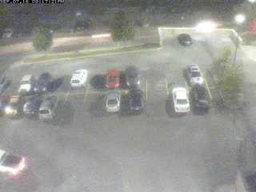
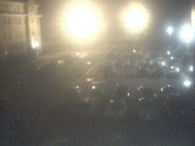
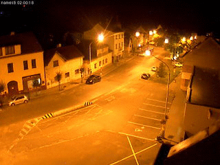

# Eureka-ParkingLotDetection
Parking Lot Occupancy Tracking

## Wiki

Don't forget we need to keep our **[wiki](../../wiki)** updated!

## Video Surveillance Software (we need to choose)
- Linux
  - https://zoneminder.com/
  - https://kerberos.io/
-Windows 
  - https://www.ispyconnect.com/
  

## Open Street Cams

Here are a few unprotected surveillance cameras of parking lots. These can be used as test images since we have zero control
over camera angle or the coverage area. If we can make our software work on these (maybe not Southern Maine) we will be good
to go.

- [West Virginia U Parking Lot](http://www.opentopia.com/webcam/11480) (good example)

- Current Still Photo: http://cemrcam1.cemr.wvu.edu/snapshotJPEG?resolution=640x480
- Current Live Feed: http://cemrcam1.cemr.wvu.edu/nphMotionJpeg?Resolution=640x480&Quality=Clarity
- Current Control Panel:  http://cemrcam1.cemr.wvu.edu/CgiStart?page=Single&Language=0

- [Southern Maine Dorm](http://www.opentopia.com/webcam/16165) (dirty)

- [Czech Republic](http://www.opentopia.com/webcam/16031) (good shadow)

- http://www.opentopia.com/webcam/11235
- http://www.opentopia.com/webcam/16271

## Image Processing

Relevant Terms for our project

  - Color Detection
  - Edge Detection
  - Object Detection
  - Boundaries
  - Bounding Box
  - Etc.
  - [Glossery](http://usabilityetc.com/articles/image-processing-glossary/)
  

## Image Processing Links

- http://www.pyimagesearch.com/2014/08/04/opencv-python-color-detection/
- https://opencv-python-tutroals.readthedocs.io/en/latest/py_tutorials/py_tutorials.html
    

## Background Publications
  - [Digital Image Processing Techniques for Object Detection From Complex Background Image](./papers/digital_image_processing_object_detection.pdf)
  - [Intelligent Parking Space Detection System Based on Image Processing](./papers/intelligent_system.pdf)
  - [COUNTING AVAILABLE PARKING SPACE USING IMAGE PROCESSING](./papers/counting_available.pdf)
  - [Intelligent Parking Management System Based on Image Processing](./papers/intelligent_management_system.pdf)
  - [Vacant Parking Space Detection in Static Images](./papers/vacant_parking_space_detection.pdf)
  - [Parking Lot Space Detection](./papers/parking_lot_space_detection.pdf)
